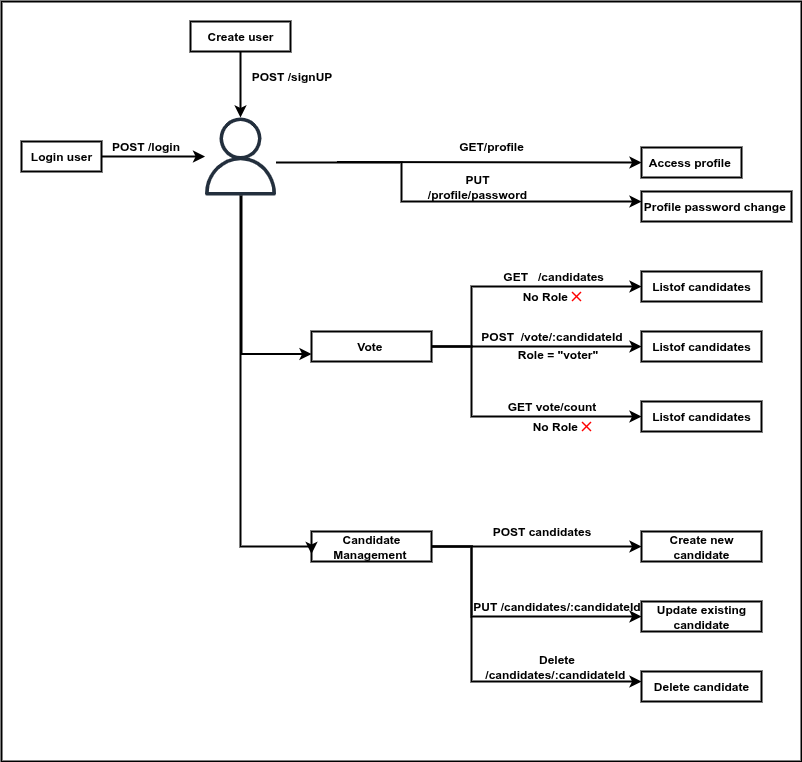

# Voting Application

This is a backend application for a voting system where users can vote for candidates. It provides functionalities for user authentication, candidate management, and voting.

## Features

- User sign up and login with Aadhar Card Number and password
- User can view the list of candidates
- User can vote for a candidate (only once)
- Admin can manage candidates (add, update, delete)
- Admin cannot vote

## Technologies Used

- Node.js
- Express.js
- MongoDB
- JSON Web Tokens (JWT) for authentication

## Installation

1. Clone the repository:
   git clone https://github.com/vijayarawat/VotingApplication.git
   cd voting_app
2. Install dependencies:
   npm install
3. Start the server:
    node server.js

# API Endpoints
## User Authentication:
POST /signup : Create a new user account  
POST /login : Login to existing user account 

## Voting: 
GET  /candidates : Get the list of candidates  
POST /vote/:candidateId : Vote for a specific candidate 

## Vote counts:
GET /vote/counts :  Get the count of votes for each candidate sorted by their vote count  
    
## User Profile:
GET /profile : Get the user profile details  
PUT /profile/password : Change user  password  

## Admin Candidate Management 
POST /candidates : Add a new candidate (Admin only)  
POST /candidates/:candidateId : Update a candidate by ID (Admin only)  
POST /candidates/:candidateId : Delete a candidate by ID (Admin only)  

